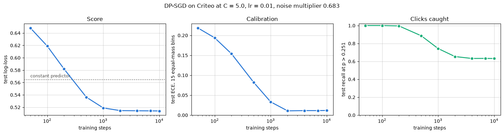
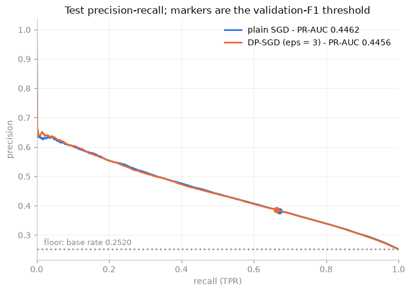
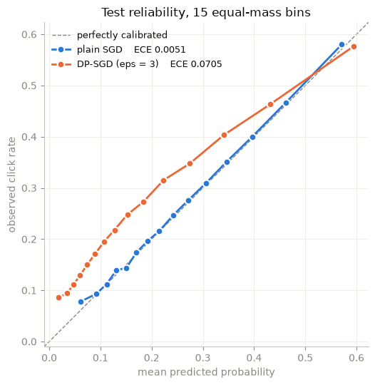
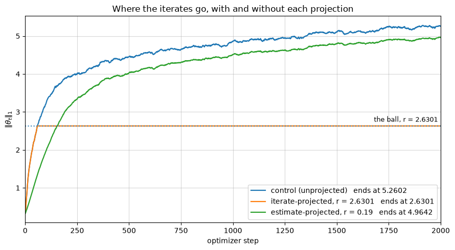
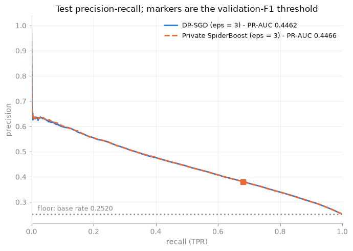

# Evaluation on Criteo

Executed runs live in `notebooks/` — per-algorithm hyperparameter tuning
under `tuning/`, head-to-head comparisons under a shared protocol under
`comparisons/`. This page cites each by its repo path and collects what
they found. The dataset throughout is Criteo click
prediction (1M rows: 800,000 train, 200,000 test), with logistic
regression as the model.

## How results are read

**Selection is threshold-free; reporting is not.** Click prediction never
converts a probability into a class — the number is multiplied into a bid
or used to order a slate — and a metric that needs an operating point lets
each configuration pick its own, which is not a comparison. So models are
*selected* on strictly proper scores (log loss), read alongside
calibration and ranking, and *reported* with a headline confusion matrix
at one named cut, chosen under a stated rule and frozen before the split
it is reported on. `dimma.metrics` is built around exactly this line, and
the [metrics page](evaluation-stack/metrics.md) gives the reasoning for
each number below — proper scores, the calibration–resolution split, and
how far a difference is trusted.

**ROC-AUC and accuracy are never reported.** Criteo's base rate is near
25%: the false-positive-rate axis is dominated by the majority class, so
ROC-AUC flatters every model and compresses the differences a comparison
exists to show, and accuracy is degenerate — predicting nothing scores
75%. PR-AUC (against a base-rate floor of 0.252, not zero) or a confusion
matrix is the headline.

**The baseline is the anchor.** Every headline number below is a distance
to the [non-private baseline](algorithms/baselines.md) run on the same
stages, same data, same model, same optimizer — not an absolute.

**The reported ε carries stated caveats.** The preprocessing statistics
(medians, frequencies, means, standard deviations) are fitted on the
training split, which is the standard benchmark convention and *not* a
private operation; the hyperparameter searches are likewise unaccounted.
Every notebook states this next to its ε rather than absorbing it.

## DP-SGD alone, over its grid

`notebooks/tuning/dp-sgd-on-one-hot-criteo.ipynb`. DP-SGD at ε = 3,
δ = 1e-6 over 10,000 steps, swept over clipping norm × learning rate at a
fixed budget. The 26 categorical columns are one-hot at their native
train-split cardinalities — 551,947 coordinates, each row carried as the
39 it occupies — rather than collapsed to one relative-frequency float
apiece. The selected configuration (clipping norm `C = 5.0`, learning
rate `lr = 0.3`) reaches test log-loss 0.4827 (constant predictor:
0.5645) and PR-AUC 0.5190 (base-rate floor: 0.2520).

Two findings shape everything downstream. **What costs utility at this
budget is mostly the clipping**: at the selected learning rate, moving
`C` from 1.0 to 5.0 is worth 0.1241 of log-loss (0.6068 → 0.4827), where
switching the noise off is worth 0.0044 — a noiseless
control (same clipping, same sampling, noise multiplier at zero for
practical purposes) reaches 0.4783 and PR-AUC 0.5287. And **the run is
not finished early**: PR-AUC climbs 0.5058 → 0.5190 between 3,000 and
10,000 steps, so the third of the ε those steps spend is buying
something.

Both of those read differently on the frequency encoding, where the
noiseless control landed on the *same* scores as the private run and the
last 8,000 steps moved only the fourth decimal. There are 551,947 weights
here against 40, most of them touched by a small fraction of the rows, so
the run has more to do and takes longer to do it.

*Test log-loss, ECE, and recall against training steps (log scale), from
the DP-SGD sweep. The dotted line is the constant predictor.*

## DP-SGD against non-private SGD

`notebooks/comparisons/dp-sgd-vs-sgd-baseline-on-criteo.ipynb`. Both
arms on identical data (norm bound `R = 2.0`), identical initialization,
identical step count; grids of comparable size, the same selection rule on
both sides; the DP arm at ε = 3, δ = 1e-6.

| test | log-loss | ECE | PR-AUC |
|---|---|---|---|
| constant | 0.5645 | 0.0000 | 0.2520 |
| plain SGD | 0.5123 | 0.0051 | 0.4462 |
| DP-SGD (ε = 3) | 0.5402 | 0.0705 | 0.4456 |

**At this budget the ranking cost is not measurable and the calibration
cost is.** Test PR-AUC differs by 0.0006 — and the sign of that gap flips
under a three-seed repeat, so the arms cannot be separated on ranking. The
log-loss gap of 0.0279 is real, and its decomposition puts it almost
entirely in the calibration term (+0.0265) rather than resolution
(−0.0008): the private model ranks as well as the baseline but its stated
probabilities are off. At each model's F1 operating point the two land on
the same F1 of 0.4879.

*Test precision–recall, from the DP-SGD-vs-SGD-baseline comparison:
the two curves lie on top of each other. Markers sit at each model's
validation-F1 operating point; the dotted floor is the base rate.*

*The other half of the finding, from the DP-SGD-vs-SGD-baseline
comparison: test reliability over 15 equal-mass bins. Plain SGD (ECE
0.0051) hugs the diagonal; DP-SGD at ε = 3 (ECE 0.0705) under-predicts
through the low and middle bins.*

## DP-SGD against its two projected counterparts

`notebooks/comparisons/dp-sgd-vs-its-projected-counterparts-on-criteo.ipynb`.
Six arms differing *only* in the optimizer object: unwrapped DP-SGD,
[`l1_projected`](transforms/l1-projection.md) (iterates) at a loose and a
binding radius, and `l1_projected_estimate` (estimate) at a loose radius,
the paper-prescribed radius, and a radius forced below what the mechanism
releases. Both wrappers post-process, so every arm carries the identical
ε = 3.

**The finding is two-sided.** Constraining the *iterates* costs what
constraining iterates costs: at half the control's final norm, 0.0040
log-loss and 0.0124 PR-AUC, with 7 of 40 parameters zeroed — flat until
the ball is tight, then steep. Constraining the *estimate* does nothing at
any radius with a principle behind it: identical to the control at the
paper's prescription, and worth 0.0001 log-loss even when forced 2.1×
below the released norm. The instrumented reason: the released estimate
settles at ‖g̃‖₁ ≈ 0.41 against a prescribed ball of 31.6 — the identity
map with 1.9 decades to spare. The denoising bound wants sparse
per-example gradients, and a dense 40-parameter logistic model has none.

*Where the iterates go, from the projected-DP-SGD comparison: the
unprojected control, the iterate-projected arm pinned to its ball from
step 59 on, and the estimate-projected arm tracking the control almost
unchanged.*

## Private SpiderBoost against DP-SGD

`notebooks/comparisons/spiderboost-vs-dp-sgd-on-criteo.ipynb`. The
DP-SGD-vs-SGD-baseline comparison's protocol inherited verbatim; both
arms at ε = 3, δ = 1e-6, exactly 10,000 steps; 60- and 54-run grids,
per-model frozen operating points, three-seed repeats.

| test | log-loss | ECE | PR-AUC |
|---|---|---|---|
| constant | 0.5645 | 0.0000 | 0.2520 |
| DP-SGD | 0.5123 | 0.0041 | 0.4462 |
| Private SpiderBoost | 0.5123 | 0.0038 | 0.4466 |

**The finding is a null one, and it is instructive.** Every gap in the
table sits inside the spread its own arm produces from a change of seed:
at this budget, on this problem, choosing between dimma's two private
algorithms costs nothing that survives a re-run — at a measured wall-clock
overhead of 1.05× per step. What *moves* the comparison is tuning: a gap
between two private algorithms reported without both grids beside it is
mostly a gap between two tuning efforts.

One caveat the matched table cannot show: **the two epsilons are
comparable quantities, not comparable guarantees.** DP-SGD's sensitivity
is *enforced* by an operation; Private SpiderBoost's is
[*assumed* from constants](algorithms/spiderboost.md) an enforced feature
bound supplies. A reader who takes the two ε = 3 columns as the same
promise has read one of them wrong.

*Test precision–recall, from the SpiderBoost-vs-DP-SGD comparison:
the dashed SpiderBoost curve sits exactly on DP-SGD's across the whole
range — the null finding in one image.*

## What the categorical encoding costs

`notebooks/comparisons/what-the-categorical-encoding-costs.ipynb`.
Criteo's 26 categorical columns get one of three treatments — dropped,
replaced by their train-split relative frequency, or one-hot at native
cardinality — and each treatment is run twice, at its noiseless ceiling
and at ε = 1, δ = 1e-7 over 3,000 steps. Same rows, same split seed, same
model, loss, optimizer, step count, expected lot, accountant and
selection rule throughout; each arm searches its own copy of one
clipping-norm × learning-rate grid.

| test | log-loss | ECE | PR-AUC |
|---|---|---|---|
| constant | 0.5645 | 0.0008 | 0.2520 |
| numeric only, non-private | 0.5198 | 0.0187 | 0.4332 |
| numeric only (ε = 1) | 0.5200 | 0.0198 | 0.4333 |
| frequency, non-private | 0.5130 | 0.0101 | 0.4464 |
| frequency (ε = 1) | 0.5132 | 0.0109 | 0.4468 |
| one-hot, non-private | 0.4783 | 0.0083 | 0.5281 |
| one-hot (ε = 1) | 0.4972 | 0.0093 | 0.4856 |

**One-hot wins by more than privacy costs.** Private one-hot reaches
PR-AUC 0.4856 against non-private frequency's 0.4464 and non-private
numeric-only's 0.4332, so the encoding — paid for at ε = 1 — beats both
dense arms running with the noise off.

**The frequency encoding recovers little of what the categorical columns
carry.** Dropping all 26 costs 0.0949 of PR-AUC against one-hot (0.4332
against 0.5281, both non-private); replacing them with train-split
frequencies buys back 0.0132 of that, about a seventh of the gap.

**Privacy is free on the dense arms and not on the wide one.** Both dense
encodings move inside the fourth decimal between their noiseless and
private runs, where one-hot pays 0.5281 → 0.4856 — about a fifth of its
resolution, which is the √d arithmetic the dimension predicts, paid and
still won. The standardization confound runs *towards* the arms that
lost: the dense arms standardize and one-hot cannot, so a fitted
preprocessing step the losers received cannot explain the winner.
